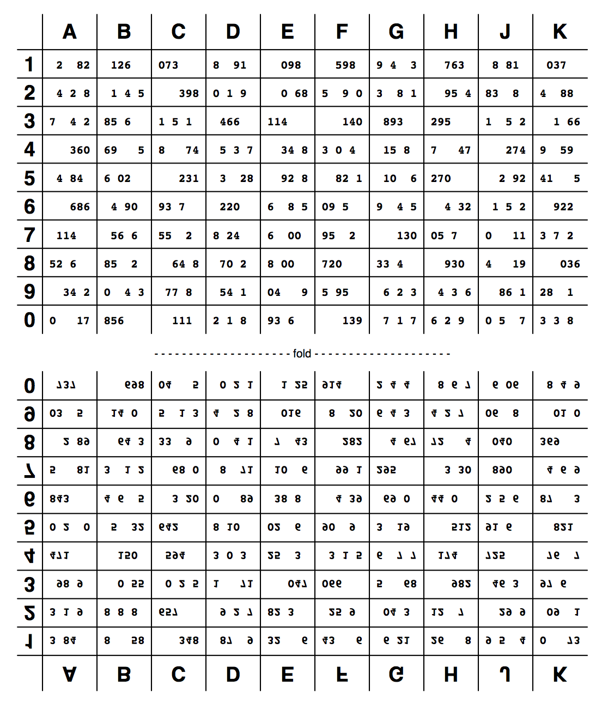

Paper OTP
=========

Paper OTP Code generator
------------------------

Manage a single-page PDF containing single-use numeric tokens. The tokens
are generated using the RFC6238 algorithm with the X/Y coordinate as
the interval number. The "secret" seed values used here are base32-encoded
strings of length 16.

When deploying this, it's important to never use the same code twice. It's 
probably best to pick randomly from the set of codes you've never asked for.

See the example files, both generated with 'aaaaaaaaaaaaaaaa' as the secret.

- [Example PDF file](example.pdf)
- [Example text file](example.txt)

More about Coinkite
-------------------

Coinkite is the world's easiest and most powerful web wallet for
safely holding all your cryptocurrencies, including Bitcoin and Litecoin.

[Learn more about all we offer](https://coinkite.com/)

Licence
-------

Code is licenced under the [2-clause BSD licence](licence.md)
